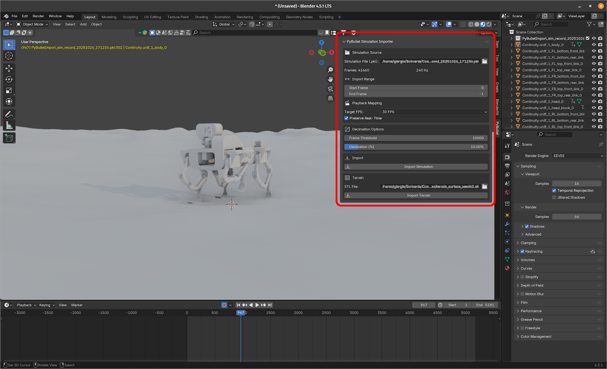

PyBullet-Blender Simulation Importer
==================================

A two-part toolkit that connects PyBullet simulations with Blender, enabling realistic and high-quality visualisation and replay of robotic motion.

This project includes:
1. pyBulletSimRecorder – a lightweight recorder that captures PyBullet simulations and saves them as structured .pkl files.
2. pyBulletSimImporter – a Blender add-on that reads those .pkl files, reconstructs the animation, and optionally imports the terrain mesh for rendering.

<p align="center">
  
</p>

📦 Features
-----------

🎥 pyBulletSimRecorder
- Records the position and orientation of every object or link in the simulation.
- Exports all data as .pkl with metadata (simulation frequency, total frames, object count).
- Works as a standalone module – no external dependencies required.
- Supports seed-based file naming and terrain mesh export via Trimesh (optional).

🧩 pyBulletSimImporter (Blender Add-on)
- Imports .pkl simulation data into Blender as animated objects.
- Supports real-time playback or frame-rate remapping (24 / 30 / 60 FPS).
- Allows range selection (e.g., import only frames 6000–36000).
- Includes a decimation system to reduce import time for long simulations.
- Optional terrain import: loads STL meshes generated by the recorder.
- Fully integrated UI in the Blender side-panel.


🧠 Concept
-----------

The bridge provides a direct workflow between physics simulation and cinematic visualisation.
Instead of static videos or logs, every simulation becomes a replayable 3D animation that can be explored from any camera angle and rendered with Blender’s path-tracing engine.
This enables comparison between different training sessions, visual debugging, and presentation-ready renders for robotics research.


🧱 Repository Structure
-----------------------

PyBullet-2-Blender-Simulation-Importer/
- pyBulletSimRecorder.py     # Standalone simulation recorder for PyBullet
- pyBulletSimImporter.py          # Blender add-on for importing .pkl files
- README.md                          # Documentation and usage instructions
- terrains/                          # (Optional) auto-generated STL terrains


⚙️ Requirements
----------------

| Component | Recommended Version |
|------------|--------------------|
| Python | 3.10 – 3.12 |
| Blender | 4.5 or later |
| PyBullet | ≥ 3.2.5 |
| Trimesh | (optional) for terrain STL export |

To install Trimesh (only needed if exporting terrains):
    pip install trimesh numpy


🚀 Usage
---------

1️⃣ Recording a Simulation

In your PyBullet script:
    from pyBulletSimRecorder import PyBulletRecorder

    rec = PyBulletRecorder()
    rec.start()        # start recording
    # run your PyBullet simulation here
    rec.stop()
    rec.save("recordings/sim_record.pkl")

Optionally, generate and save a terrain mesh:
    rec._build_heightfield(cfg)

⚠️ Note:
The _build_heightfield() function includes only the STL export logic.
The actual height generation algorithm is intentionally omitted.
Any heightfield that produces a float32 matrix H (in meters) can be exported.


2️⃣ Importing into Blender

1. Copy pyBulletSimImporter_v3.py to:
       ~/.config/blender/4.5/scripts/addons/
2. Open Blender → Edit → Preferences → Add-ons → Install → select the file → Enable.
3. A new tab named “PyBullet” will appear in the sidebar (N panel).
4. Choose your .pkl simulation, adjust settings (frame range, decimation, playback speed), and click Import Simulation.
5. (Optional) Import a terrain STL through the Terrain section.


🌍 Terrain Mesh Export
----------------------

The recorder can generate a surface mesh (STL) from a procedural heightfield.

Example excerpt:

    ```python
    mesh = trimesh.Trimesh(vertices=vertices, faces=faces, process=False)
    os.makedirs("terrains", exist_ok=True)
    mesh.export(stl_path)
    print(f"[Terrain] STL surface saved to {stl_path}")

These meshes can be loaded later in Blender using the importer’s “Terrain” section.


🧩 Plugin Workflow
------------------

1. Record Simulation → pyBulletSimRecorder.py
2. Export .pkl + optional STL terrain
3. Import in Blender → pyBulletSimImporter.py
4. Render & Analyse in Blender’s animation timeline


💻 Installation via GitHub Clone
--------------------------------

Clone the repository:
    git clone https://github.com/<your-username>/PyBullet-2-Blender-Simulation-Importer.git
    cd PyBullet-2-Blender-Simulation-Importer


Install dependencies:
    pip install numpy trimesh pybullet

Then you can follow the usage instructions above.


📜 License
-----------

This project is licensed under the GNU General Public License v3 (GPLv3).

Copyright (C) 2025  Giorgio Clivio

This program is free software: you can redistribute it and/or modify
it under the terms of the GNU General Public License as published by
the Free Software Foundation, either version 3 of the License, or
(at your option) any later version.

This program is distributed in the hope that it will be useful,
but WITHOUT ANY WARRANTY; without even the implied warranty of
MERCHANTABILITY or FITNESS FOR A PARTICULAR PURPOSE.  See the
GNU General Public License for more details.

You should have received a copy of the GNU General Public License
along with this program.  If not, see <https://www.gnu.org/licenses/>.

